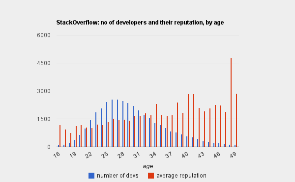
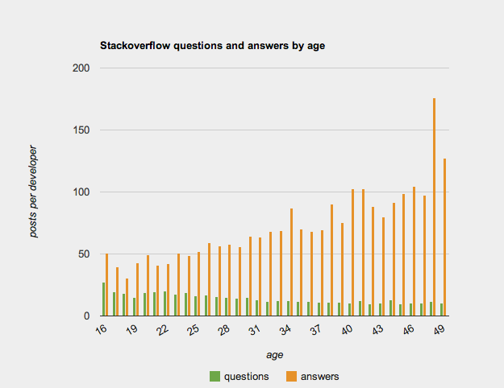

## Dlaczego miałbyś zatrudnić właśnie mnie?

  Developers get better with age. And scarcer. 

Na starym wpisie z Bloga:
https://docs.google.com/spreadsheets/d/1Xc2WDW6-D3EB-nyqqbkXI0xcF_rVZfjn3W5WKP7jJlA/edit?hl=en_GB&pli=1&pli=1&hl=en_GB&hl=en_GB#gid=2

With a simple bash script to download the data, a small Java program to extract the stats and Google Docs to make the graphs, I was able to produce some interesting stats.

I pulled in data of about 70.000 developers whose Stackoverflow reputation is over 100. On average 53% of them have their age listed in their profiles. So the sample was 37.400 users.

In the graphs I only included data if there were at least 100 developers in the age group. Full stats and interactive graphs are available here.

